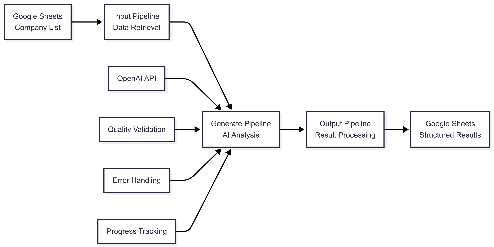

# OpenAI Company Research and Summarization System

<div align="center">

[](https://www.python.org/downloads/)
[](https://openai.com/)
[](https://developers.google.com/sheets)

*An intelligent, AI-powered system for automated company research and business analysis*

</div>

---

## 📖 Table of Contents

- [Overview](#-overview)
- [System Architecture](#️-system-architecture)
- [Key Features](#-key-features)
- [Technical Approach](#-technical-approach--design-philosophy)
- [Quick Start](#-quick-start)
- [Configuration](#️-configuration)
- [Usage Examples](#-usage-examples)
- [Output Format](#-output-format)
- [Project Structure](#-project-structure)
- [Performance & Optimization](#-performance--optimization)
- [Troubleshooting](#️-troubleshooting)
- [Contributing](#-contributing)
- [License](#-license)

---

## 🎯 Overview

The **OpenAI Company Research and Summarization System** is a sophisticated, production-ready solution that automates comprehensive business analysis using advanced AI technology. Built for business analysts, researchers, and investment professionals, it streamlines the process of analyzing multiple companies by leveraging OpenAI's language models and Google Sheets integration.

### 🎪 What Makes This System Unique

- **🧠 Intelligent Prompt Engineering**: Professionally crafted prompts that ensure consistent, high-quality business analysis
- **🔄 End-to-End Automation**: Complete workflow from data input to structured output
- **🛡️ Enterprise-Grade Reliability**: Robust error handling, rate limiting, and quality validation
- **📊 Structured Intelligence**: Automatic extraction of business metrics and metadata
- **⚡ Scalable Processing**: Efficient batch processing with real-time progress tracking

---

## 🏗️ System Architecture

The system implements a **modular three-stage pipeline architecture** designed for reliability, scalability, and maintainability:



### 🔧 Core Components

| Component | Responsibility | Key Features |
|-----------|---------------|--------------|
| **Input Pipeline** | Data retrieval and validation | Intelligent column detection, data cleaning |
| **Generate Pipeline** | AI-powered analysis | Prompt engineering, quality validation, batch processing |
| **Output Pipeline** | Result formatting and storage | Metadata extraction, professional formatting |

---

## ✨ Key Features

<details>
<summary><strong>🤖 AI-Powered Analysis</strong></summary>

- **Professional Prompt Engineering**: Sophisticated prompts designed for consistent business analysis
- **Multi-Model Support**: Compatible with GPT-4, GPT-3.5-turbo, and other OpenAI models
- **Quality Validation**: Automatic response assessment with confidence scoring
- **Structured Output**: Consistent, parseable summary format with standardized sections

</details>

<details>
<summary><strong>📊 Google Sheets Integration</strong></summary>

- **Flexible Input**: Intelligent detection of company name columns across different formats
- **Professional Output**: Auto-formatted worksheets with comprehensive data organization
- **Metadata Extraction**: Automatic parsing of industry, business model, and confidence data
- **Direct Access**: Shareable URLs for immediate stakeholder access

</details>

<details>
<summary><strong>🛡️ Reliability & Performance</strong></summary>

- **Smart Rate Limiting**: Intelligent API quota management with configurable limits
- **Retry Mechanisms**: Exponential backoff for rate limits and API errors
- **Batch Processing**: Efficient handling of multiple companies with progress tracking
- **Error Isolation**: Individual failures don't disrupt batch operations

</details>

<details>
<summary><strong>📈 Monitoring & Observability</strong></summary>

- **Real-time Progress**: Live progress tracking during batch operations
- **Comprehensive Logging**: Multi-level logging (DEBUG, INFO, WARNING, ERROR)
- **Status Classification**: Clear success/warning/error categorization
- **Performance Metrics**: Duration tracking and completion statistics

</details>

---

## 🧠 Technical Approach & Design Philosophy

### 🎨 Prompt Engineering Strategy

The system employs a **sophisticated prompt engineering approach** designed to ensure consistent, high-quality business analysis across diverse company types and industries.

#### **Structured Prompt Architecture**

```
┌─ ROLE DEFINITION ────────────────────────────────────┐
│ Professional business analyst with market expertise  │
├─ CONTEXT ────────────────────────────────────────────┤
│ Company research and competitive analysis framework  │
├─ INSTRUCTIONS ───────────────────────────────────────┤
│ Systematic analysis methodology with clear structure │
├─ OUTPUT FORMAT ──────────────────────────────────────┤
│ Structured sections with standardized headers        │
└─ QUALITY GUIDELINES ─────────────────────────────────┘
  Factual accuracy requirements and uncertainty handling
```

#### **Key Engineering Principles**

1. **🎯 Consistency Through Structure**
   - Standardized section headers (`COMPANY OVERVIEW`, `INDUSTRY & SECTOR`, etc.)
   - Consistent formatting for automated parsing
   - Clear uncertainty handling instructions

2. **👔 Professional Business Perspective**
   - Expert business analyst persona
   - Focus on publicly available, verifiable information
   - Professional tone appropriate for business use

3. **🔄 Adaptive Context Handling**
   - Dynamic company name injection
   - Flexible handling across industries and company sizes
   - Graceful management of limited information scenarios

4. **📊 Metadata-Rich Output**
   - Structured sections enabling automatic extraction
   - Built-in confidence indicators
   - Standardized categorization systems

### 🛡️ Reliability & Quality Assurance

#### **Multi-Layer Validation System**

```python
# Response Quality Validation
def _validate_response(self, response: str) -> bool:
    # ✅ Minimum length threshold (100+ characters)
    # ✅ Required section presence (2+ out of 3 critical sections)
    # ✅ Content structure validation
```

#### **Intelligent Error Handling**

```python
@sleep_and_retry
@limits(calls=60, period=60)  # Rate limiting decorator
def _make_api_call(self, prompt: str) -> str:
    # 🔄 Exponential backoff for rate limits (60-second wait)
    # ⚡ Quick retry for API errors (5-second wait)
    # 🛡️ Maximum retry limits with graceful degradation
```

### ⚙️ Model Parameter Optimization

The system uses **carefully tuned parameters** optimized for professional business research:

```env
TEMPERATURE=0.7         # Balanced creativity for diverse industries
TOP_P=0.9              # Comprehensive coverage while maintaining focus
FREQUENCY_PENALTY=0.1   # Minimal repetition, thorough analysis
PRESENCE_PENALTY=0.1    # Encourages comprehensive topic coverage
MAX_TOKENS=2000        # Detailed analysis while managing costs
```

#### **Parameter Rationale**

- **Temperature (0.7)**: Optimal balance between consistency and adaptability
- **Top-P (0.9)**: Ensures comprehensive coverage without losing focus
- **Penalties (0.1)**: Light touch to encourage completeness without restriction
- **Token Limit (2000)**: Adequate for detailed summaries while cost-effective

---

## 🚀 Quick Start

### 📋 Prerequisites

- **Python 3.8+** installed on your system
- **OpenAI API Key** with sufficient credits
- **Google Service Account** with Sheets API access
- **Google Sheets Document** prepared with company names

### 📦 Installation

1. **Clone the repository**:
   ```bash
   git clone <repository-url>
   cd OpenAI-company-research-and-summarization-system
   ```

2. **Install dependencies**:
   ```bash
   pip install -r requirements.txt
   ```

3. **Set up credentials**:
   ```bash
   # Place your Google service account JSON in credentials/
   cp your-credentials.json credentials/
   
   # Configure environment
   cp .env.example .env
   # Edit .env with your configuration
   ```

### 🎬 First Run

```bash
python main.py
```

**What happens next:**
1. 📥 Reads company names from your Google Sheets
2. 🤖 Generates AI-powered summaries for each company
3. 📊 Creates a structured results worksheet
4. 🔗 Provides direct access URL to results

---

## ⚙️ Configuration

### 🔧 Environment Variables

Create a `.env` file with the following configuration:

```env
# 📊 Google Sheets Configuration
GOOGLE_SHEETS_CREDENTIALS_FILE=credentials/your-service-account.json
GOOGLE_SHEETS_ID=your_google_sheets_document_id

# 🤖 OpenAI Configuration
OPENAI_API_KEY=your_openai_api_key
MODEL=gpt-4-turbo
MAX_TOKENS=2000
TEMPERATURE=0.7
TOP_P=0.9
FREQUENCY_PENALTY=0.1
PRESENCE_PENALTY=0.1

# ⚡ Operational Settings
MAX_RETRIES=3
RATE_LIMIT_CALLS_PER_MINUTE=50
PROMPT_PATH=prompts/company_research.txt
```

### 🎛️ Model Parameters Guide

| Parameter | Range | Recommended | Purpose |
|-----------|-------|-------------|---------|
| **TEMPERATURE** | 0.0-2.0 | 0.7 | Creativity vs. consistency balance |
| **TOP_P** | 0.0-1.0 | 0.9 | Token selection diversity |
| **FREQUENCY_PENALTY** | -2.0-2.0 | 0.1 | Repetition reduction |
| **PRESENCE_PENALTY** | -2.0-2.0 | 0.1 | Topic variety encouragement |
| **MAX_TOKENS** | 1-4096 | 2000 | Response length control |

---

## 💡 Usage Examples

### 🔄 Basic Batch Processing

```python
from src.company_research_and_summarization_system.pipelines.generate_pipeline import GeneratePipeline

def progress_callback(current, total, company_name):
    progress = (current / total) * 100
    print(f"🔄 Progress: {progress:.1f}% - Processing: {company_name}")

companies = ["Apple Inc.", "Microsoft Corp.", "Google LLC"]
pipeline = GeneratePipeline(companies, progress_callback)
results = pipeline.run()
```

### 🎨 Custom Prompt Engineering

Modify `prompts/company_research.txt` for specialized analysis:

```text
Analyze {company_name} and provide a comprehensive business summary focusing on:

COMPANY OVERVIEW:
- Core business description and value proposition
- Founded date, headquarters, and key leadership

INDUSTRY & SECTOR:
- Primary industry classification
- Market position and competitive landscape

FINANCIAL PERFORMANCE:
- Revenue model and key financial metrics
- Growth trajectory and profitability

[... additional custom sections ...]
```

### 📊 Advanced Configuration

```python
from src.company_research_and_summarization_system.config.configuration import ConfigurationManager
from src.company_research_and_summarization_system.entity.config_entity import OpenAIServiceConfig

# Custom configuration
config = OpenAIServiceConfig(
    OPENAI_API_KEY="your-key",
    MODEL="gpt-4-turbo",
    MAX_TOKENS=3000,  # Longer summaries
    TEMPERATURE=0.5,  # More conservative
    # ... other parameters
)
```

---

## 📊 Output Format

The system generates a **structured worksheet** with comprehensive business intelligence:

| Column | Description | Example |
|--------|-------------|---------|
| **Company Name** | Original identifier | "Apple Inc." |
| **Summary** | Full AI analysis | "Apple Inc. is a multinational technology..." |
| **Processing Status** | Success indicator | "✅ Success" |
| **Timestamp** | Processing time | "2025-08-11 14:30:25" |
| **Error Message** | Failure details | "Rate limit exceeded" |
| **Data Confidence** | AI confidence level | "HIGH" |
| **Industry** | Classification | "Consumer Electronics" |
| **Key Activities** | Business operations | "Design, manufacture, and market..." |
| **Target Market** | Customer segments | "Consumers, businesses, education..." |
| **Business Model** | Revenue approach | "Hardware sales, services, subscriptions" |

### 📈 Sample Output Structure

```
COMPANY OVERVIEW:
Apple Inc. is a multinational technology company headquartered in Cupertino, California...

INDUSTRY & SECTOR:
Consumer Electronics, Software Services

KEY BUSINESS ACTIVITIES:
- Design and manufacture consumer electronics
- Software and services development
- Digital content and services

DATA CONFIDENCE: HIGH
```

---

## 📁 Project Structure

```
OpenAI-company-research-and-summarization-system/
├── 🐍 main.py                          # Application entry point
├── 📚 README.md                        # Documentation (this file)
├── 📦 requirements.txt                 # Python dependencies
├── 🔐 credentials/                     # Google Sheets credentials
│   ├── credentials_template.json       # Template for setup
├── 📋 logs/                           # Application logs
│   └── company_research_*.log          # Detailed execution logs
├── 🎯 prompts/                        # AI prompt templates
│   └── company_research.txt            # Main prompt template
└── 📂 src/company_research_and_summarization_system/
    ├── 🎛️ config/                     # Configuration management
    │   └── configuration.py            # Environment variable handling
    ├── 📊 entity/                      # Data structures
    │   └── config_entity.py            # Configuration dataclasses
    ├── 🔄 pipelines/                   # Processing stages
    │   ├── input_pipeline.py           # Google Sheets data retrieval
    │   ├── generate_pipeline.py        # AI summary generation
    │   └── output_pipeline.py          # Result processing
    └── 🛠️ services/                    # External integrations
        ├── google_sheets_service.py    # Google Sheets API
        └── openai_service.py           # OpenAI API integration
```

---

## 📈 Performance & Optimization

### 🚀 Rate Limiting Best Practices

1. **🎯 Start Conservative**: Begin with 30-50 calls/minute
2. **📊 Monitor Usage**: Track API consumption in OpenAI dashboard
3. **💰 Cost Management**: Choose appropriate models for accuracy needs
4. **📦 Batch Optimization**: Process companies in manageable batches

---

## 🛠️ Troubleshooting

### 🚨 Common Issues & Solutions

<details>
<summary><strong>🔐 Authentication Errors</strong></summary>

**Symptoms**: `GoogleAuthError`, `Invalid API key`

**Solutions**:
- ✅ Verify Google Service Account has Sheets API access
- ✅ Check OpenAI API key validity and credits
- ✅ Ensure credentials file path is correct
- ✅ Validate spreadsheet sharing permissions

```bash
# Test Google Sheets access
python -c "from src.company_research_and_summarization_system.services.google_sheets_service import GoogleSheetsService; print('✅ Access verified')"
```

</details>

<details>
<summary><strong>⚡ Rate Limiting Issues</strong></summary>

**Symptoms**: `RateLimitError`, slow processing

**Solutions**:
- 🔧 Reduce `RATE_LIMIT_CALLS_PER_MINUTE` (try 30)
- ⏰ Increase delays between requests
- 📊 Check OpenAI account tier limits
- 💰 Consider upgrading OpenAI plan

```env
# Conservative rate limiting
RATE_LIMIT_CALLS_PER_MINUTE=30
MAX_RETRIES=5
```

</details>

<details>
<summary><strong>📊 Quality Issues</strong></summary>

**Symptoms**: Poor summary quality, missing sections

**Solutions**:
- 🎛️ Adjust model parameters (lower temperature for consistency)
- 📝 Refine prompt template for specific needs
- 📏 Increase `MAX_TOKENS` for longer summaries
- 🎯 Use higher-tier models (GPT-4 vs GPT-3.5)

```env
# Quality-focused configuration
MODEL=gpt-4-turbo
TEMPERATURE=0.5
MAX_TOKENS=2500
```

</details>

### 🔍 Debug Mode

Enable detailed logging for troubleshooting:

```python
import logging
logging.getLogger('company_research_and_summarization_system').setLevel(logging.DEBUG)
```

### 📋 Health Check

```bash
# Verify system health
python -c "
from src.company_research_and_summarization_system.config.configuration import ConfigurationManager
config = ConfigurationManager()
print('✅ Configuration loaded successfully')
"
```

---

